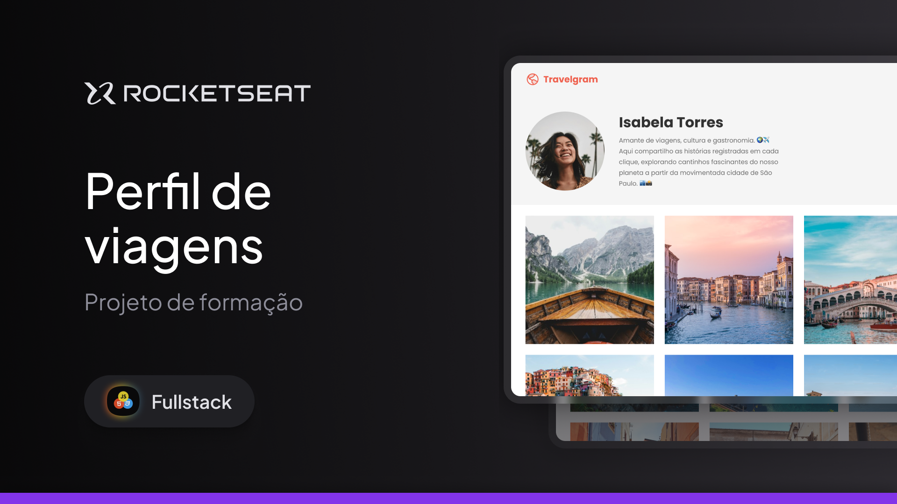
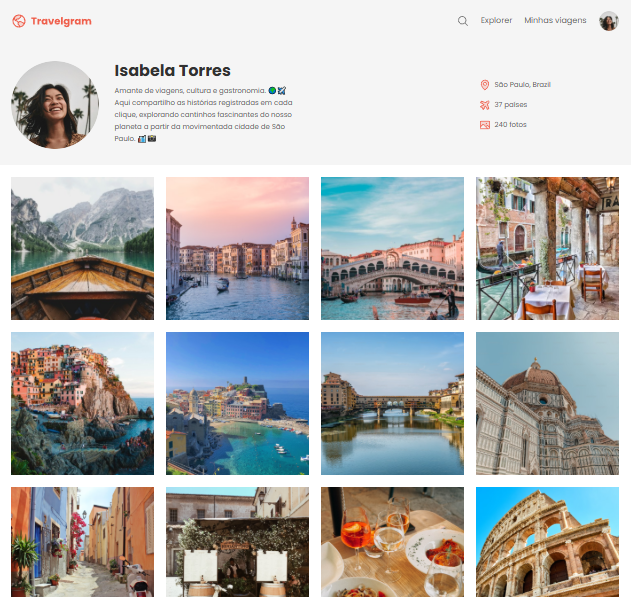

# 🧳 Travelgram

## Perfil: Isabela Torres

<div align="center">
  
</div>

Este projeto é uma página estática desenvolvida com **HTML e CSS**, simulando uma rede social de viagens chamada **Travelgram**, onde a personagem fictícia _Isabela Torres_ compartilha suas aventuras pelo mundo.

---

## 🧭 Descrição

O objetivo deste projeto é praticar a estruturação de páginas web com HTML semântico e estilização com CSS puro, organizando um perfil pessoal de viagens com galeria de fotos, informações de localização e estatísticas de experiências.

---

## ✨ Funcionalidades

- ✅ Estrutura semântica com seções bem definidas.
- 🧍 Perfil fictício com avatar e descrição.
- 🌍 Informações de localização e estatísticas de viagem.
- 🖼️ Galeria de fotos temáticas.
- 🎨 Estilização com variáveis CSS, espaçamento e tipografia personalizada.
- 📱 Layout responsivo e organizado.
- ❤️ Rodapé com marca e links institucionais.

---

## 🖼️ Prévia do Projeto

<div align="center">
  
</div>

---

## ⚙️ Tecnologias Utilizadas

- HTML5
- CSS3

---

## 📁 Estrutura de Pastas

```
travelgram/
│
├── assets/
│ ├── Logo.svg
│ ├── Profile pic.png
│ ├── project_cover.png
│ ├── project_image.png
│ ├── icons/
│ │ ├── AirplaneTilt.svg
│ │ ├── Image.svg
│ │ ├── MagnifyingGlass.svg
│ │ └── MapPin.svg
│ └── images/
│ ├── Image 01.png
│ ├── Image 02.png
│ └── ... (até Image 12.png)
│
├── styles/
│ ├── footer.css
│ ├── global.css
│ ├── header.css
│ ├── index.css
│ ├── main.css
│ └── nav.css
│
├── index.html
├── .gitignore
└── readme.md
```

---

## 📚 Aprendizados Aplicados

- Estruturação semântica com HTML5
- Estilização modular com CSS separado por seções
- Uso de variáveis CSS para padronização
- Tipografia com Google Fonts
- Organização de conteúdo visual com flexbox
- Implementação de galeria de imagens
- Boas práticas de responsividade e espaçamento
- Organização de projeto e boas práticas de versionamento

---

## ✍️ Autor

Desenvolvido por **Rocketseat**  
Adaptado e implementado por **William Milanez**

---

## 📄 Licença

Este projeto é de uso educacional e livre para fins de estudo e prática pessoal.
